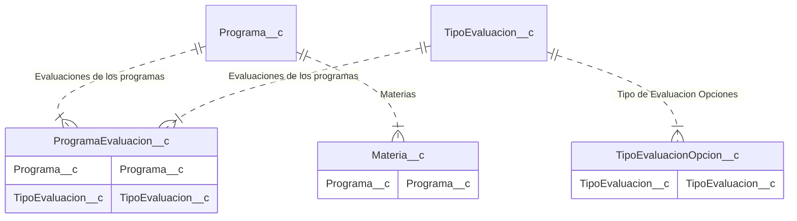

# Crear un Programa

## Contexto

- Cuando: En la migración inicial o eventualmente si se abren nuevos programas de estudio
- Precondición: Haber ingresado al sistema de Salesforce Caacupe
- Postcondición: Que estén cargadas todas las materias del programa con todas las reglas necesarias
- Actores: [Secretaria](/tags/secretaria)

## Flujo Principal

## Flujos Alternativos

## Modelo de Datos

