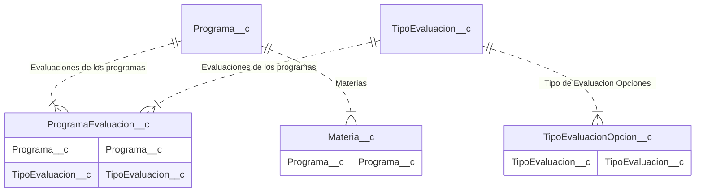

# Exportar Programa

- Modulo: [configuracion](/configuracion)
- Roles: [secretaria](/tags/secretaria)

## Descripcion:

En la view de un programa poner un boton exportar para crear un json con todos los datos de programa**c, ProgramaEvaluacion**c, TipoEvaluacion**c, TipoEvaluacionOpcion**c y materia\_\_c

## Escenarios

1. Exportacion normal
   DADO un programa
   CUANDO secretaria apreta el boton exportar
   Se QUIERE que genere un archivos json con los datos del programa

<!-- START autogenerated-objects -->

## Objetos

### Transaccionales

| #   | Label | Api Name | Descripcion |
| --- | ----- | -------- | ----------- |

| 

 | [Evaluacion de un Programa](/diccionarios/objects/ProgramaEvaluacion__c) | ProgramaEvaluacion**c |Cada programa define los tipos de evalucaciones que quedaran reflejados como columnas del boletin.
Cada materia pondra sus notas, ya sean conceptuales o numericas de acuerdo a esta definicion|
| 

 | [Materia](/diccionarios/objects/Materia**c) | Materia**c ||
| 

 | [Programa](/diccionarios/objects/Programa**c) | Programa**c ||
| 

 | [Tipo de Evaluacion](/diccionarios/objects/TipoEvaluacion**c) | TipoEvaluacion**c ||
| 

 | [Tipo de Evaluacion Opcion](/diccionarios/objects/TipoEvaluacionOpcion**c) | TipoEvaluacionOpcion\_\_c ||

### Configuracion

| #   | Label | Api Name | Descripcion |
| --- | ----- | -------- | ----------- |

| #                                                              | Referencia    |
| -------------------------------------------------------------- | ------------- |
| 

 | Track History |

<!-- END autogenerated-objects -->
