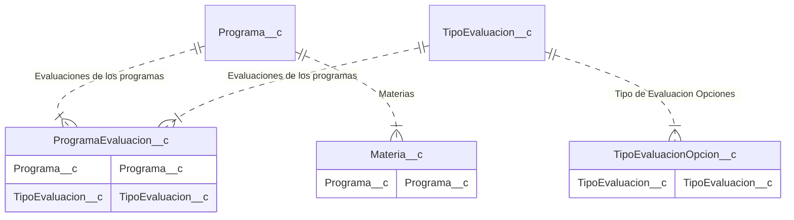

# Importar Programa

- Modulo: [configuracion](/configuracion)
- Roles: [secretaria](/tags/secretaria)

## Descripcion:

En la tab de programas hablitar el boton importar para crear un programa desde un json.
El formato del json tiene que tener los campos de programa**c, ProgramaEvaluacion**c, TipoEvaluacion**c, TipoEvaluacionOpcion**c y materia\_\_c

<!-- START autogenerated-objects -->

## Objetos

### Transaccionales

| #                                                                                            | Label                                                                      | Api Name                  | Descripcion                                                                                        |
| -------------------------------------------------------------------------------------------- | -------------------------------------------------------------------------- | ------------------------- | -------------------------------------------------------------------------------------------------- |
| 

                                                                    | [Evaluacion de un Programa](/diccionarios/objects/ProgramaEvaluacion__c)   | ProgramaEvaluacion\_\_c   | Cada programa define los tipos de evalucaciones que quedaran reflejados como columnas del boletin. |
| Cada materia pondra sus notas, ya sean conceptuales o numericas de acuerdo a esta definicion |
| 

                                                                    | [Materia](/diccionarios/objects/Materia__c)                                | Materia\_\_c              |                                                                                                    |
| 

                                                                    | [Programa](/diccionarios/objects/Programa__c)                              | Programa\_\_c             |                                                                                                    |
| 

                                                                    | [Tipo de Evaluacion](/diccionarios/objects/TipoEvaluacion__c)              | TipoEvaluacion\_\_c       |                                                                                                    |
| 

                                                                    | [Tipo de Evaluacion Opcion](/diccionarios/objects/TipoEvaluacionOpcion__c) | TipoEvaluacionOpcion\_\_c |                                                                                                    |

### Configuracion

| #   | Label | Api Name | Descripcion |
| --- | ----- | -------- | ----------- |

| #                                                              | Referencia    |
| -------------------------------------------------------------- | ------------- |
| 

 | Track History |

<!-- END autogenerated-objects -->
