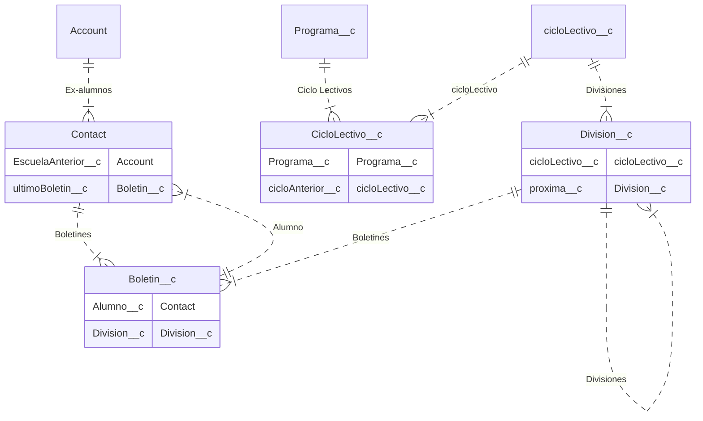

# Configuracion

## Modelo de datos

<!-- START autogenerated-objects -->

## Objetos

### Transaccionales

| #                                                              | Label                                                  | Api Name          | Descripcion |
| -------------------------------------------------------------- | ------------------------------------------------------ | ----------------- | ----------- |
| 

                                      | [Boletin](/diccionarios/objects/Boletin__c)            | Boletin\_\_c      |             |
| 

                                      | [Ciclo Lectivo](/diccionarios/objects/CicloLectivo__c) | CicloLectivo\_\_c |             |
| 

 | [Contact](/diccionarios/objects/Contact)               | Contact           |             |
| 

                                      | [Division](/diccionarios/objects/Division__c)          | Division\_\_c     |             |

### Configuracion

| #   | Label | Api Name | Descripcion |
| --- | ----- | -------- | ----------- |

| #                                                              | Referencia    |
| -------------------------------------------------------------- | ------------- |
| 

 | Track History |

<!-- END autogenerated-objects -->
