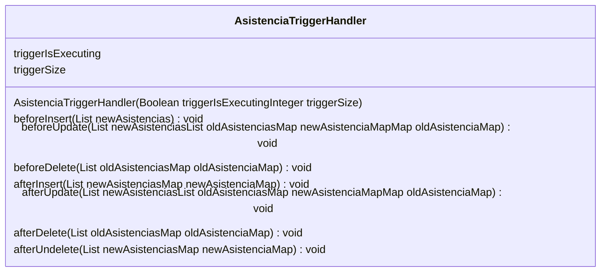

## Introducción

<!-- START autogenerated-class -->
## Descripción

- Status: Active
- Api Version: 58
- Creada: 2 de noviembre de 23
- Modificada: 21 de noviembre de 23
- Interface 
        * [TriggerHandler](/diccionarios/classes/TriggerHandler)

## Diagrama

### Metodos
*Constructores*
| #   | Argumentos |
| --- | ---------- |
| 

 | <ul><li>Boolean triggerIsExecuting</li><li>Integer triggerSize</li></ul>|

*Metodos*
| #   | Nombre | Return | Argumentos |
| --- | ------ | ------ | ---------- |
| 

 | beforeInsert | void| <ul><li>List newAsistencias</li></ul>|
| 

 | beforeUpdate | void| <ul><li>List newAsistencias</li><li>List oldAsistencias</li><li>Map newAsistenciaMap</li><li>Map oldAsistenciaMap</li></ul>|
| 

 | beforeDelete | void| <ul><li>List oldAsistencias</li><li>Map oldAsistenciaMap</li></ul>|
| 

 | afterInsert | void| <ul><li>List newAsistencias</li><li>Map newAsistenciaMap</li></ul>|
| 

 | afterUpdate | void| <ul><li>List newAsistencias</li><li>List oldAsistencias</li><li>Map newAsistenciaMap</li><li>Map oldAsistenciaMap</li></ul>|
| 

 | afterDelete | void| <ul><li>List oldAsistencias</li><li>Map oldAsistenciaMap</li></ul>|
| 

 | afterUndelete | void| <ul><li>List newAsistencias</li><li>Map newAsistenciaMap</li></ul>|

| #  | Referencia       | #  | Referencia |
| -- | ---------------- | -- | ---------- |
| +  | public or global | #  | protected  |
| -  | private          | ~  | Package    |
| $  | final or static  | *  | abstract   |

<!-- END autogenerated-class -->
