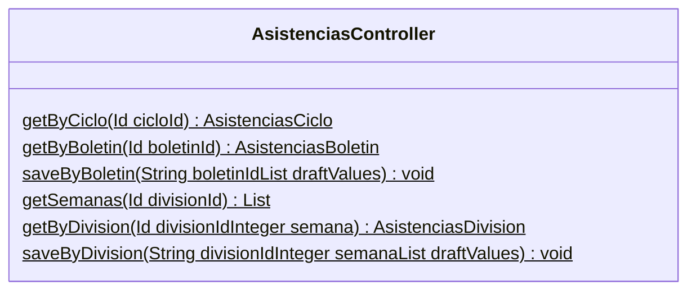

## Introducción

<!-- START autogenerated-class -->
## Descripción

- Status: Active
- Api Version: 57
- Creada: 1 de agosto de 23
- Modificada: 21 de noviembre de 23
- Interface 

## Diagrama

### Metodos

*Metodos*
| #   | Nombre | Return | Argumentos |
| --- | ------ | ------ | ---------- |
| 
$
 | getByCiclo | AsistenciasCiclo| <ul><li>Id cicloId</li></ul>|
| 
$
 | getByBoletin | AsistenciasBoletin| <ul><li>Id boletinId</li></ul>|
| 
$
 | saveByBoletin | void| <ul><li>String boletinId</li><li>List draftValues</li></ul>|
| 
$
 | getSemanas | List| <ul><li>Id divisionId</li></ul>|
| 
$
 | getByDivision | AsistenciasDivision| <ul><li>Id divisionId</li><li>Integer semana</li></ul>|
| 
$
 | saveByDivision | void| <ul><li>String divisionId</li><li>Integer semana</li><li>List draftValues</li></ul>|

| #  | Referencia       | #  | Referencia |
| -- | ---------------- | -- | ---------- |
| +  | public or global | #  | protected  |
| -  | private          | ~  | Package    |
| $  | final or static  | *  | abstract   |

<!-- END autogenerated-class -->
