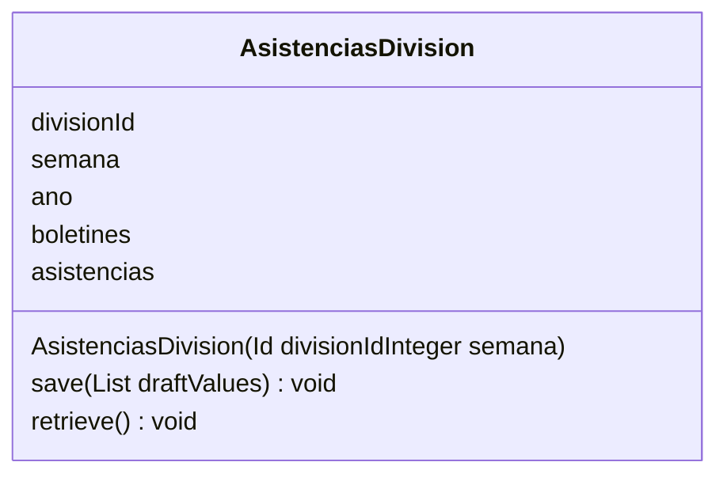

## Introducción

<!-- START autogenerated-class -->
## Descripción

- Status: 
- Api Version: 
- Creada: 
- Modificada: 
- Interface 

## Diagrama

### Metodos
*Constructores*
| #   | Argumentos |
| --- | ---------- |
| 

 | <ul><li>Id divisionId</li><li>Integer semana</li></ul>|

| #   | Nombre | Return | Argumentos |
| --- | ------ | ------ | ---------- |
| 

 | save | void| <ul><li>List draftValues</li></ul>|
| 

 | retrieve | void| <ul></ul>|

| #  | Referencia       | #  | Referencia |
| -- | ---------------- | -- | ---------- |
| +  | public or global | #  | protected  |
| -  | private          | ~  | Package    |
| $  | final or static  | *  | abstract   |

<!-- END autogenerated-class -->
