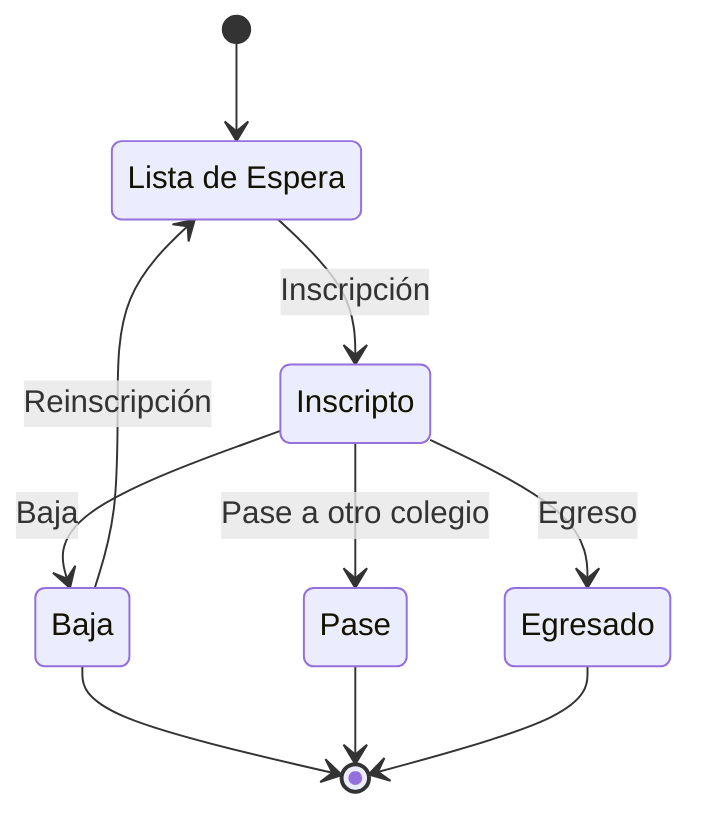

# Inscripción

Este proceso se incia cuando un alumno quiere ingresar al colegio

## Contexto

- Cuando: Cuando un posible alumno quiere ingresar al colegio debe realizar este proceso
- Precondición: Haber ingresado al sistema de Salesforce Caacupe
- Postcondición: Tener un nuevo registro de alumno en estado “Pendiente” (Lista de espera)

* Actores: [Secretaria](/tags/secretaria)

**Diagrama de Estados de la Inscripción**

## Flujo Principal

### Pasos

1. Seleccionar la aplicación Caacupe (del selector de aplicaciones).
   Si no aparece, usar el buscador

2. Seleccionar la pestaña “Contacto”
   Apretar el botón “Nuevo”

- Dejar tipo de registro en “alumno” y apretar “Siguiente”
- Llenar los campos
- Datos del estudiante
- Apellido
- Nombre
- Nro de documento
- Tipo (DNI, CIP, CIB, LC, LE, PAS, CIPE)
- Sexo (F/M)
- Fecha de nacimiento
- CUIL
- Nacido en (lugar)
- Nacionalidad (Argentina, Paraguaya, Boliviana, Brasilera, Chilena, Peruana, otros)
- Domicilio
- Localidad
- CP
- Teléfono del estudiante
-     Datos del responsable
- Nombre
- Apellido
- Domicilio
- Teléfono
- Teléfono alternativo
- Datos escuela
- Tipo de escuela (Estatal / Privada)
- Escuela origen
- Nacional (provincias)
- Exterior (paises)
- Certificado (7mo, A200, ADUL, BP, CBO, CENS, EGB, ESBA, MEDIA, OPEL, POL, CFP, otro)
- Nombre de la escuela
- Ver si se puede modificar:
- Sacar Tratamiento de las opciones
  Colocar en la misma fila apellido y nombre
  Debajo de eso colocar Tipo de DNI y número de documento
  Colocar la fecha de nacimiento y que por formula me arroje la edad

Cargar las relaciones
Ir a la lista relacionada de “Relaciones”

## Flujos Alternativos
