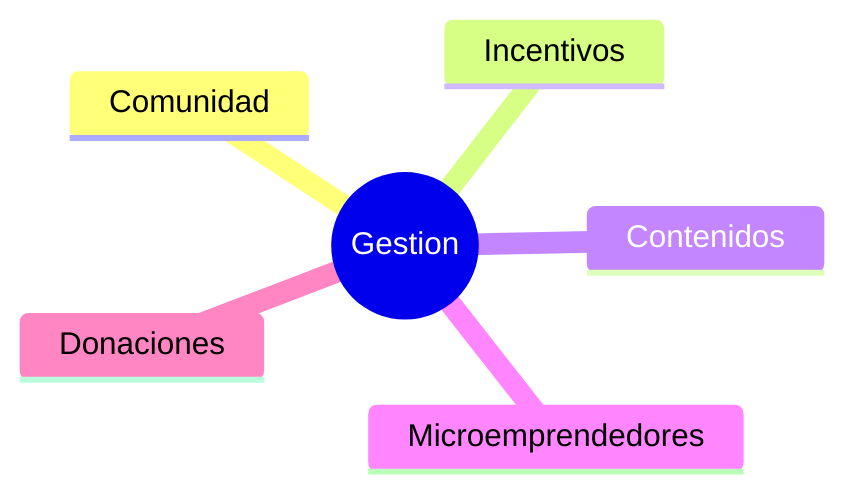

# Caacupe

## Objetivos

- Reducir la tasa de deserción escolar (por motivos económicos)
- Brindar a los chicos una herramienta laboral al finalizar el colegio
- Motivar a los chicos a formar parte de la comunidad.

## Modulos

- Gestion
- Comunidad
  - Calendario de Actividades
- Incentivos
  - Metricas
  - Badges y recompensas instantaneas
  - Niveles
  - Catalogo de Recompensas
  - Leaderboards & Tableros
- Contenidos
- Microemprendedores
- Donaciones
