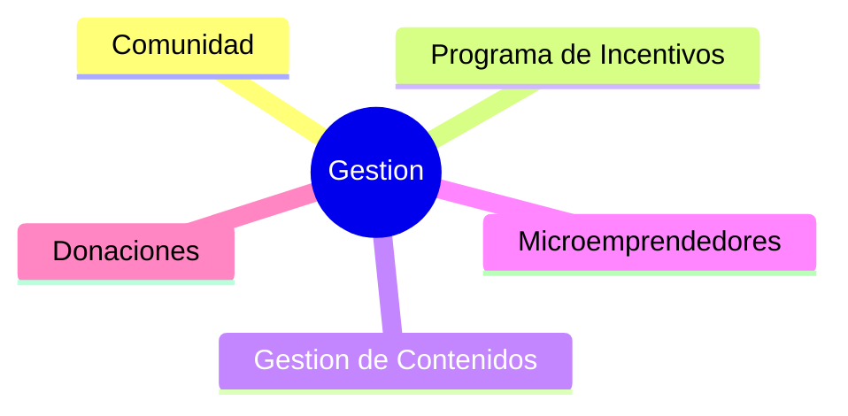

# Caacupe

## Objetivos

- Reducir la tasa de deserción escolar (por motivos económicos)
- Brindar a los chicos una herramienta laboral al finalizar el colegio
- Motivar a los chicos a formar parte de la comunidad.

## Modulos

- Gestion
  - Configuración
  - Inscripción
  - Asistencias
  - Evaluaciones
- Comunidad
  - Calendario de Actividades
- Programa de Incentivos
  - Reglas, desafios, metricas
  - Badges y recompensas instantaneas
  - Niveles
  - Catalogo de Recompensas
  - Leaderboards & Tableros
- Gestion de Contenidos
- Microemprendedores
- Donaciones
