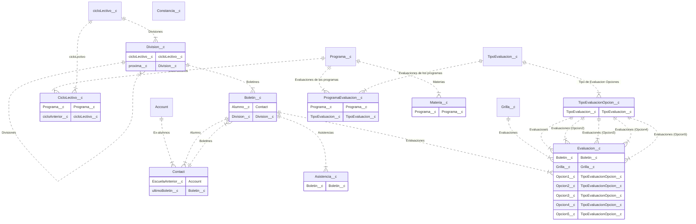

# Caacupe

## Objetivos

- Reducir la tasa de deserción escolar (por motivos económicos)
- Brindar a los chicos una herramienta laboral al finalizar el colegio
- Motivar a los chicos a formar parte de la comunidad.

## Modulos

- Gestion
- Comunidad
  - Calendario de Actividades
- Incentivos
  - Metricas
  - Badges y recompensas instantaneas
  - Niveles
  - Catalogo de Recompensas
  - Leaderboards & Tableros
- Contenidos
- Microemprendedores
- Donaciones
<!-- START autogenerated-objects -->

## Objetos

### Transaccionales

| #                                                                                            | Label                                                                      | Api Name                  | Descripcion                                                                                        |
| -------------------------------------------------------------------------------------------- | -------------------------------------------------------------------------- | ------------------------- | -------------------------------------------------------------------------------------------------- |
| 

                                                                    | [Asistencia](/diccionarios/objects/Asistencia__c)                          | Asistencia\_\_c           | Contiene las asistencias semanales de un alumno                                                    |
| 

                                                                    | [Boletin](/diccionarios/objects/Boletin__c)                                | Boletin\_\_c              |                                                                                                    |
| 

                                                                    | [Ciclo Lectivo](/diccionarios/objects/CicloLectivo__c)                     | CicloLectivo\_\_c         |                                                                                                    |
| 

                                                                    | [Constancia](/diccionarios/objects/Constancia__c)                          | Constancia\_\_c           |                                                                                                    |
| 

                               | [Contact](/diccionarios/objects/Contact)                                   | Contact                   |                                                                                                    |
| 

                                                                    | [Division](/diccionarios/objects/Division__c)                              | Division\_\_c             |                                                                                                    |
| 

                                                                    | [Evaluacion](/diccionarios/objects/Evaluacion__c)                          | Evaluacion\_\_c           |                                                                                                    |
| 

                                                                    | [Evaluacion de un Programa](/diccionarios/objects/ProgramaEvaluacion__c)   | ProgramaEvaluacion\_\_c   | Cada programa define los tipos de evalucaciones que quedaran reflejados como columnas del boletin. |
| Cada materia pondra sus notas, ya sean conceptuales o numericas de acuerdo a esta definicion |
| 

                                                                    | [Materia](/diccionarios/objects/Materia__c)                                | Materia\_\_c              |                                                                                                    |
| 

                                                                    | [Programa](/diccionarios/objects/Programa__c)                              | Programa\_\_c             |                                                                                                    |
| 

                                                                    | [Tipo de Evaluacion](/diccionarios/objects/TipoEvaluacion__c)              | TipoEvaluacion\_\_c       |                                                                                                    |
| 

                                                                    | [Tipo de Evaluacion Opcion](/diccionarios/objects/TipoEvaluacionOpcion__c) | TipoEvaluacionOpcion\_\_c |                                                                                                    |

### Configuracion

| #   | Label | Api Name | Descripcion |
| --- | ----- | -------- | ----------- |

| #                                                              | Referencia    |
| -------------------------------------------------------------- | ------------- |
| 

 | Track History |

<!-- END autogenerated-objects -->
