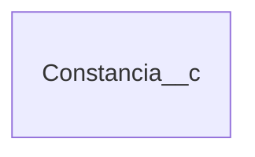

## Introducción

<!-- START autogenerated -->
## Objetos

### Transaccionales
| # | Label | Api Name | Descripcion | 
|---|------|----------|-------------|
| 

 | [Constancia](/docs/diccionarios/objects/Constancia__c) | Constancia__c ||

### Configuracion
| # | Label | Api Name | Descripcion | 
|---|-------|----------|-------------|

| # | Referencia |  
|---|------------|
|

 | Track History |

<!-- END autogenerated -->