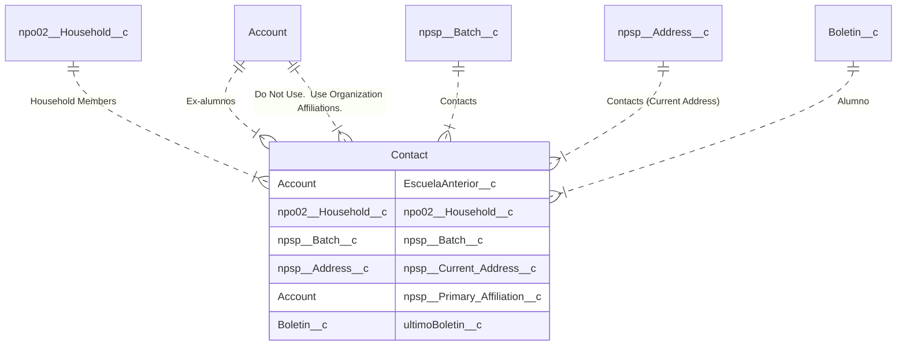

## Introducción

<!-- START autogenerated -->

## Objetos

### Transaccionales

| #                                                              | Label                                         | Api Name | Descripcion |
| -------------------------------------------------------------- | --------------------------------------------- | -------- | ----------- |
| 

 | [Contact](/docs/diccionarios/objects/Contact) | Contact  |             |

### Configuracion

| #   | Label | Api Name | Descripcion |
| --- | ----- | -------- | ----------- |

| #                                                              | Referencia    |
| -------------------------------------------------------------- | ------------- |
| 

 | Track History |

<!-- END autogenerated -->
